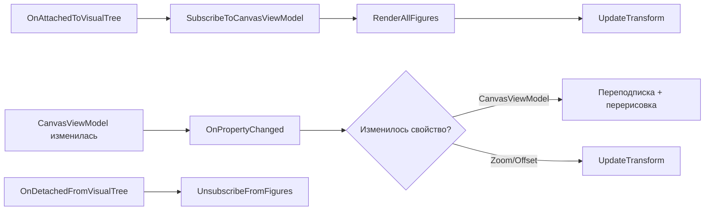

# Controls

Документация по пользовательским элементам управления графического редактора **INKognida**.

## 📁 Структура папки

```
Controls/
├── VectorCanvasControl.axaml      # Разметка контрола холста
├── VectorCanvasControl.axaml.cs   # Логика контрола холста
├── ColorPickerPopup.axaml         # Всплывающая палитра цветов
├── ColorPickerPopup.axaml.cs      # Логика палитры цветов
└── ...
```

---

## 🎨 VectorCanvasControl

Основной пользовательский контрол для отрисовки векторных фигур на канвасе. Отвечает за рендеринг, обработку выделения, масштабирование и привязку к ViewModel.

### 📋 Назначение

- Отрисовка фигур из `CanvasViewModel`
- Обработка событий мыши (нажатие, перемещение, отпускание)
- Визуализация выделения фигур
- Поддержка масштабирования и панорамирования
- Реактивное обновление UI при изменении моделей

### 🔧 Зависимые свойства (Attached Properties)

| Свойство | Тип | Описание | Значение по умолчанию |
|----------|-----|----------|---------------------|
| `CanvasViewModel` | `CanvasViewModel?` | ViewModel канваса для привязки данных | `null` |
| `Zoom` | `double` | Коэффициент масштабирования | `1.0` |
| `OffsetX` | `double` | Смещение по оси X | `0` |
| `OffsetY` | `double` | Смещение по оси Y | `0` |

### 📦 Публичные методы

#### `ShowPreviewFigure(FigureViewModel? figure)`
Отображает или скрывает предварительную фигуру в процессе рисования.

```csharp
public void ShowPreviewFigure(FigureViewModel? figure)
{
    // Удаляет старую preview-фигуру и добавляет новую
    // Устанавливает opacity=0.5 и IsHitTestVisible=false
}
```

#### `ScreenToCanvas(Avalonia.Point screenPoint)`
Преобразует экранные координаты в координаты канваса с учётом зума и смещения.

```csharp
public Point2D ScreenToCanvas(Avalonia.Point screenPoint)
{
    // Возвращает координаты в пространстве канваса
    return new Point2D(
        (screenPoint.X - OffsetX) / Zoom,
        (screenPoint.Y - OffsetY) / Zoom);
}
```

### 🔐 Приватные методы (ключевые)

| Метод | Назначение |
|-------|-----------|
| `CreateControlForFigure()` | Фабрика: создаёт Avalonia-контрол для заданной фигуры |
| `BindFigureProperties()` | Привязывает свойства фигуры к контролю для реактивного обновления |
| `UpdateSelectionVisual()` | Добавляет/удаляет рамку выделения вокруг фигуры |
| `UpdatePolygonGeometry()` | Обновляет геометрию Path при изменении вершин многоугольника |
| `OnFigurePointerPressed()` | Обработчик клика по фигуре (выделение или ластик) |
| `RenderFigure()` / `RemoveFigure()` | Добавление/удаление фигуры с канваса |

### 🔄 Подписка на события ViewModel

Контрол автоматически подписывается на:
- `CanvasViewModel.PropertyChanged` — изменение активного слоя, preview-фигуры, выделения
- `Figures.CollectionChanged` — добавление/удаление фигур в активном слое
- `SelectedFigures.CollectionChanged` — изменение выделения

```csharp
private void SubscribeToCanvasViewModel()
{
    if (CanvasViewModel != null)
    {
        CanvasViewModel.PropertyChanged += OnCanvasViewModelPropertyChanged;
        // Подписка на коллекции фигур...
    }
}
```

### 🎯 Поддерживаемые типы фигур

| Тип фигуры | Создаваемый контроль | Примечание |
|-----------|---------------------|-----------|
| `RectangleViewModel` | `Rectangle` или `Path` | Квадраты обрабатываются отдельно |
| `EllipseViewModel` | `Ellipse` или `Path` | Круги — частный случай эллипса |
| `LineViewModel` | `Line` | Прямая линия |
| `PolygonViewModel` | `Path` | Многоугольники, треугольники |
| `PenPointViewModel` | `Ellipse` | Точки пера (маленькие круги) |
| `TextViewModel` | `TextBlock` | Текст с поддержкой редактирования |
| `GroupViewModel` | `Panel` | Контейнер для дочерних фигур |

### 🖱️ Обработка ввода

Контрол не обрабатывает события мыши напрямую — они делегируются в `MainWindowViewModel`:

```xml
<!-- MainWindow.axaml -->
<local:VectorCanvasControl 
    x:Name="VectorCanvas"
    PointerPressed="OnCanvasPointerPressed"
    PointerMoved="OnCanvasPointerMoved"
    PointerReleased="OnCanvasPointerReleased"/>
```

```csharp
// MainWindow.axaml.cs
private void OnCanvasPointerPressed(object? sender, PointerPressedEventArgs e)
{
    var point = VectorCanvas.ScreenToCanvas(e.GetPosition(VectorCanvas));
    _viewModel?.HandlePointerPressed(e);
}
```

### 🎨 Визуализация выделения

При `IsSelected = true` контрол добавляет декоративную рамку (`Border`) вокруг фигуры:

```csharp
// Для прямоугольника/эллипса
var border = new Border
{
    BorderBrush = Brushes.Blue,
    BorderThickness = new Thickness(1),
    IsHitTestVisible = false,  // Не перехватывает клики
    Tag = "SelectionAdorner"
};
```

Для групп используется рамка цвета `Cyan` с тегом `"GroupSelectionAdorner"`.

### ⚙️ Жизненный цикл контрола



### 📝 Пример использования в XAML

```xml
<local:VectorCanvasControl 
    x:Name="VectorCanvas"
    CanvasViewModel="{Binding Canvas}"
    Zoom="{Binding Canvas.Zoom}"
    OffsetX="{Binding Canvas.OffsetX}"
    OffsetY="{Binding Canvas.OffsetY}"
    PointerMoved="OnCanvasPointerMoved"
    PointerPressed="OnCanvasPointerPressed"
    PointerReleased="OnCanvasPointerReleased"
    Background="{StaticResource CheckerBrush}"/>
```

### 🐛 Отладка

Контрол использует `DebugLog.Write()` для трассировки:

```
[DEBUG] CanvasVM binding changed: Old=12345, New=67890
[DEBUG] OnFiguresChanged: Action=Add, NewItems=1
[DEBUG] Rendering new figure: Прямоугольник
[DEBUG] UpdateSelectionVisual: Rectangle1, IsSelected=True
```

Для включения логов убедитесь, что `DebugLog.IsEnabled = true` в настройках приложения.

---

## 🧩 Расширение контрола

### Добавление нового типа фигуры

1. Создайте ViewModel, наследующую `FigureViewModel`
2. Добавьте обработку в `CreateControlForFigure()`:

```csharp
private Control? CreateControlForFigure(FigureViewModel figure)
{
    return figure switch
    {
        // ... существующие типы ...
        MyNewShapeViewModel shape => CreateMyNewShape(shape),
        _ => null
    };
}
```

3. Реализуйте `CreateMyNewShape()` и `UpdateShapeGeometry()` для отрисовки

### Кастомизация выделения

Для изменения стиля выделения переопределите логику в `UpdateSelectionVisual()`:

```csharp
// Пример: пунктирная рамка вместо сплошной
var border = new Border
{
    BorderBrush = Brushes.Orange,
    BorderThickness = new Thickness(2),
    BorderDashArray = new DoubleCollection { 4, 2 },  // Пунктир
    // ...
};
```

---

> 💡 **Совет**: Все изменения геометрии фигур должны выполняться в `Dispatcher.UIThread.Post()`, так как Avalonia требует обновления UI только из UI-потока.