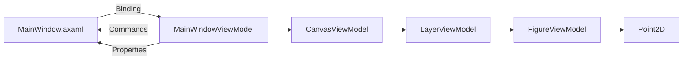
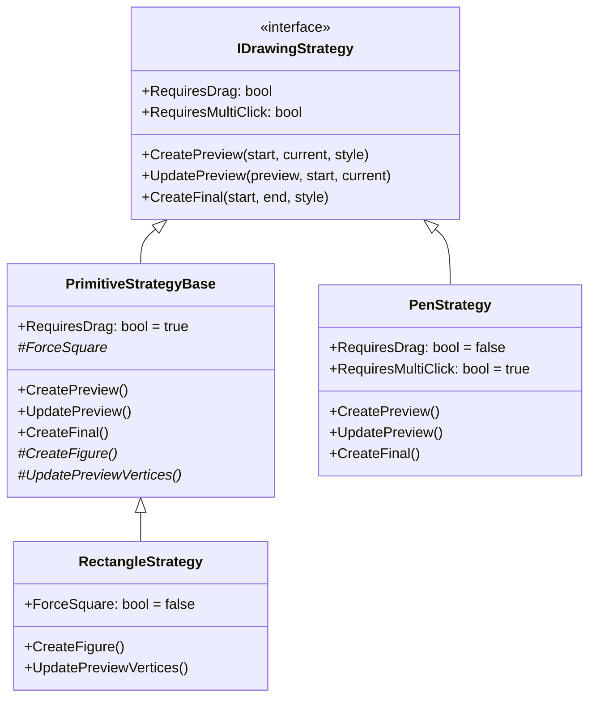
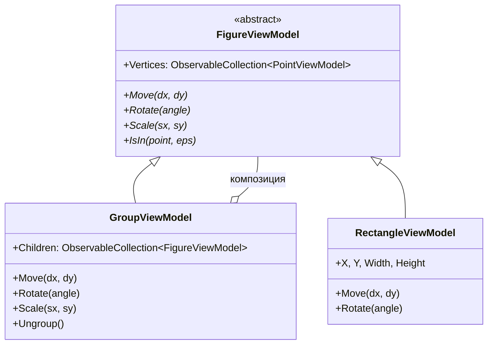
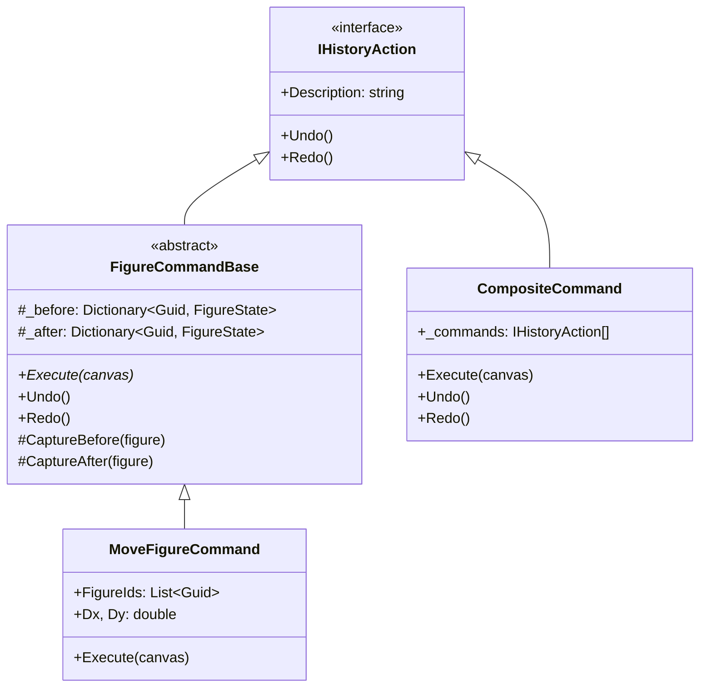

# 🎨 Паттерны проектирования в проекте "Магический графический редактор"

> **Технологический стек**: C# 12, .NET 8, Avalonia UI, ReactiveUI  
> **Архитектура**: MVVM + Clean Architecture principles

---

## 📋 Оглавление

1. [Архитектурные паттерны](#-архитектурные-паттерны)
2. [Порождающие паттерны](#-порождающие-паттерны)
3. [Структурные паттерны](#-структурные-паттерны)
4. [Поведенческие паттерны](#-поведенческие-паттерны)
5. [Принципы SOLID](#-принципы-solid)
6. [Дополнительные практики](#-дополнительные-практики)

---

## 🏗️ Архитектурные паттерны

### MVVM (Model-View-ViewModel)




**Реализация в проекте**:

| Компонент | Роль в MVVM | Пример |
|-----------|------------|--------|
| `MainWindow.axaml` | **View** — отображение UI | XAML с привязками `{Binding ...}` |
| `MainWindowViewModel` | **ViewModel** — логика и состояние | ReactiveCommand, ObservableAsPropertyHelper |
| `FigureViewModel` | **Model** — бизнес-логика фигуры | Абстрактные методы трансформаций |
| `Point2D` | **Domain Model** — чистая геометрия | Immutable record с операторами |

**Ключевые особенности**:
```csharp
// ReactiveUI-привязки в ViewModel
public string StatusMessage
{
    get => _statusMessage;
    set => this.RaiseAndSetIfChanged(ref _statusMessage, value);
}

// Команды для View
Commands = new EditorCommands(
    AddRectangle: ReactiveCommand.Create(AddRectangle),
    MoveUp: ReactiveCommand.Create(() => MoveSelected(0, -10)),
    // ...
);

// Реактивные подписки
this.WhenAnyValue(x => x.StrokeColor.Color)
    .Subscribe(color => ApplyStyleToSelected(f => f.LineColor = color));
```

---

## 🏭 Порождающие паттерны

### Strategy Pattern — Инструменты рисования

**Проблема**: Разные инструменты (прямоугольник, круг, перо) требуют разной логики создания и обновления фигур.

**Решение**: Интерфейс `IDrawingStrategy` с конкретными реализациями:




**Пример использования**:
```csharp
// ToolStrategyFactory.cs
public class ToolStrategyFactory : IToolStrategyFactory
{
    private readonly Dictionary<DrawingTool, IDrawingStrategy> _strategies;
    
    public ToolStrategyFactory(StyleSettings defaultStyle)
    {
        _strategies = new()
        {
            { DrawingTool.Rectangle, new RectangleStrategy() },
            { DrawingTool.Pen, new PenStrategy() },
            { DrawingTool.Triangle, new TriangleStrategy() },
            // ...
        };
    }
    
    public IDrawingStrategy GetStrategy(DrawingTool tool) =>
        _strategies.TryGetValue(tool, out var strategy) 
            ? strategy 
            : throw new NotSupportedException(...);
}

// В MainWindowViewModel
if (CurrentTool.IsPrimitive() && _strategyFactory.IsSupported(CurrentTool))
{
    var strategy = _strategyFactory.GetStrategy(CurrentTool);
    _drawingSession.Start(point, CurrentTool, strategy);
}
```

### Factory Method — Создание стратегий

```csharp
public interface IToolStrategyFactory
{
    IDrawingStrategy GetStrategy(DrawingTool tool);
    bool IsSupported(DrawingTool tool);
}
```

**Преимущества**:
- ✅ Новый инструмент = новый класс, без правки существующего кода (OCP)
- ✅ Легко тестировать каждую стратегию изолированно
- ✅ Централизованная регистрация инструментов

### Builder (частично) — Конструкторы фигур

```csharp
// FigureViewModel использует защищённый конструктор
protected FigureViewModel()
{
    _id = Guid.NewGuid();
    _name = GetType().Name.Replace("ViewModel", "");
    Vertices = new ObservableCollection<PointViewModel>();
}

// Конкретные фигуры расширяют логику
public RectangleViewModel(double x, double y, double w, double h, ...)
{
    Name = "Прямоугольник";
    Vertices.Add(new PointViewModel(x, y));
    Vertices.Add(new PointViewModel(x + w, y));
    // ... инициализация вершин
}
```

---

## 🔗 Структурные паттерны

### Composite Pattern — Группировка фигур




**Реализация**:
```csharp
public class GroupViewModel : FigureViewModel
{
    public ObservableCollection<FigureViewModel> Children { get; }
    
    public override void Move(double dx, double dy)
    {
        // Делегируем всем детям
        foreach (var child in Children)
            child.Move(dx, dy);
        UpdateBoundingBox();
    }
    
    public override bool IsIn(Point2D point, double eps = 0.001)
    {
        // Проверяем bounding box группы, затем детей
        if (!IsInBoundingBox(point, eps)) return false;
        return Children.Any(f => f.IsIn(point, eps));
    }
}
```

### Adapter Pattern — Конвертация цветов

```csharp
// Конвертер System.Drawing.Color → Avalonia.Media.Color
private static Avalonia.Media.Color ToAvaloniaColor(System.Drawing.Color c) => 
    Avalonia.Media.Color.FromArgb(c.A, c.R, c.G, c.B);

// Использование в VectorCanvasControl
shape.Stroke = new SolidColorBrush(ToAvaloniaColor(figure.LineColor));
```

### Decorator Pattern — PointViewModel

```csharp
// Point2D — чистая геометрия (immutable)
public record Point2D(double X, double Y)
{
    public static Point2D operator +(Point2D l, Point2D r) => ...
}

// PointViewModel — декоратор для реактивности
public class PointViewModel : ViewModelBase
{
    private double _x, _y;
    
    public double X
    {
        get => _x;
        set => this.RaiseAndSetIfChanged(ref _x, value); // ← уведомление UI
    }
    
    // Адаптер к доменной модели
    public Point2D ToPoint() => new Point2D(X, Y);
    public static PointViewModel FromPoint(Point2D point) => new(point.X, point.Y);
}
```

---

## ⚙️ Поведенческие паттерны

### Command Pattern + Memento — Undo/Redo




**Реализация команды перемещения**:
```csharp
public class MoveFigureCommand : FigureCommandBase
{
    public List<Guid> FigureIds { get; }
    public double Dx { get; }
    public double Dy { get; }
    
    public override string Description => $"Перемещение на ({Dx}, {Dy})";
    
    public override void Execute(CanvasViewModel canvas)
    {
        this.canvas = canvas;
        foreach (var id in FigureIds)
        {
            var figure = FindFigure(canvas, id);
            if (figure != null)
            {
                CaptureBefore(figure);  // Memento: сохраняем состояние
                figure.Move(Dx, Dy);     // Выполняем действие
                CaptureAfter(figure);   // Memento: фиксируем результат
            }
        }
    }
    
    public override void Undo()
    {
        // Восстанавливаем состояние из _before
        foreach (var (id, state) in _before)
            ApplyState(canvas, id, state);
    }
}
```

**Использование в ViewModel**:
```csharp
private void MoveSelected(double dx, double dy)
{
    if (Canvas?.SelectedFigures?.Any() != true) return;
    
    var cmd = new MoveFigureCommand(
        Canvas.SelectedFigures.Select(f => f.Id).ToList(), 
        dx, dy);
    
    cmd.Execute(Canvas);      // Выполняем
    _history.AddAction(cmd);  // Добавляем в историю для Undo
    
    StatusMessage = $"Перемещено на ({dx}, {dy})";
}
```

### Observer Pattern — Реактивные обновления

**Через ReactiveUI**:
```csharp
// Подписка на изменения свойств
this.WhenAnyValue(x => x.StrokeColor.Color)
    .Subscribe(color => ApplyStyleToSelected(f => f.LineColor = color));

// Автоматическое обновление UI при изменении Preview
_drawingSession.WhenAnyValue(x => x.Preview)
    .Subscribe(preview => Canvas.SetPreviewFigure(preview));
```

**Через INotifyPropertyChanged**:
```csharp
// В FigureViewModel
public string Name
{
    get => _name;
    set => this.RaiseAndSetIfChanged(ref _name, value); // ← уведомление
}

// В View (XAML)
<TextBlock Text="{Binding Name}" /> <!-- Авто-обновление -->
```

### Template Method — Базовый класс фигур

```csharp
public abstract class FigureViewModel : ViewModelBase, ITransformable, ISelectable
{
    // Шаблон: общие методы реализованы, специфичные — абстрактные
    
    // ✅ Реализовано в базовом классе
    public virtual void RadialScale(double scale) => Scale(scale, scale);
    public virtual bool HasIntersection(Point2D a, Point2D b) { /* ... */ }
    
    // ❗ Должно быть реализовано наследниками
    public abstract Point2D Center { get; }
    public abstract void Rotate(double angle);
    public abstract void Scale(double sx, double sy);
    public abstract void Move(double dx, double dy);
    public abstract bool IsIn(Point2D point, double eps);
    public abstract IEnumerable<Point2D> GetVertexPoint();
}
```

---

## 🎯 Принципы SOLID

### ✅ Single Responsibility Principle (SRP)

| Класс | Ответственность |
|-------|----------------|
| `Point2D` | Чистая геометрия: координаты, операторы, расстояния |
| `FigureViewModel` | Состояние фигуры + реактивность + базовые трансформации |
| `VectorCanvasControl` | Отрисовка фигур на холсте + привязка событий |
| `DrawingSession` | Управление состоянием процесса рисования |
| `ToolStrategyFactory` | Создание стратегий по типу инструмента |

### ✅ Open/Closed Principle (OCP)

```csharp
// ❌ Было: switch в ViewModel (нарушает OCP)
private FigureViewModel? CreatePreviewFigure(DrawingTool tool) => tool switch
{
    DrawingTool.Rectangle => new RectangleViewModel(...),
    DrawingTool.Circle => new CircleViewModel(...),
    // +новая фигура = правка этого метода
    _ => null
};

// ✅ Стало: Strategy Pattern (открыто для расширения, закрыто для модификации)
var strategy = _strategyFactory.GetStrategy(CurrentTool);
_drawingSession.Start(point, CurrentTool, strategy);
// Новая фигура = новый класс стратегии, без правки существующего кода
```

### ✅ Liskov Substitution Principle (LSP)

```csharp
// Все фигуры подставляются вместо базового типа
public void AddFigure(FigureViewModel figure)  // ← принимает любой наследник
{
    ActiveLayer?.Figures.Add(figure);  // ← работает с Rectangle, Circle, Group...
}

// Группировка работает с любыми фигурами
var group = new GroupViewModel(new[] { rect, circle, line });  // ← LSP в действии
```

### ✅ Interface Segregation Principle (ISP)

```csharp
// ❌ Было: один "жирный" интерфейс
public interface IFigure
{
    Point2D Center { get; }
    void Rotate(double angle);
    void Scale(double sx, double sy);
    void Move(double dx, double dy);
    bool IsIn(Point2D point, double eps);
    bool HasIntersection(Point2D a, Point2D b);
    IFigure Clone();
    // ... ещё 10+ методов
}

// ✅ Стало: специализированные интерфейсы
public interface ITransformable  // Только трансформации
{
    Point2D Center { get; }
    void Rotate(double angle);
    void Scale(double sx, double sy);
    void Move(double dx, double dy);
}

public interface ISelectable  // Только хит-тестинг
{
    bool IsIn(Point2D point, double eps);
    bool HasIntersection(Point2D a, Point2D b);
}

public interface ICloneableFigure  // Только клонирование
{
    IFigure Clone();
}

// FigureViewModel реализует только нужное
public abstract class FigureViewModel : ViewModelBase, 
    ITransformable, ISelectable, ICloneableFigure, IRenderable
```

### ✅ Dependency Inversion Principle (DIP)

```csharp
// ❌ Высокоуровневый модуль зависит от низкоуровневого
public class MainWindowViewModel
{
    private readonly ToolStrategyFactory _factory;  // ← конкретный класс
}

// ✅ Зависимость от абстракции
public class MainWindowViewModel
{
    private readonly IToolStrategyFactory _strategyFactory;  // ← интерфейс
    private readonly IFileService _fileService;              // ← интерфейс
    
    // Внедрение через конструктор
    public MainWindowViewModel(
        IToolStrategyFactory strategyFactory,
        IFileService fileService)
    {
        _strategyFactory = strategyFactory;
        _fileService = fileService;
    }
}
```

---

## 🧰 Дополнительные практики

### Extension Methods — Чистая геометрия

```csharp
// PointTransformExtensions.cs
public static class PointTransformExtensions
{
    public static Point2D Rotate(this Point2D point, Point2D center, double angleDegrees)
    {
        var rad = angleDegrees * Math.PI / 180.0;
        var r = point - center;
        return center + new Point2D(
            r.X * Math.Cos(rad) - r.Y * Math.Sin(rad),
            r.X * Math.Sin(rad) + r.Y * Math.Cos(rad)
        );
    }
    
    public static Point2D Scale(this Point2D point, Point2D center, double sx, double sy) =>
        center + new Point2D((point.X - center.X) * sx, (point.Y - center.Y) * sy);
}

// Использование: читаемо и интуитивно
var rotated = vertex.ToPoint().Rotate(center, angle);
var scaled = point.Scale(center, 2.0, 1.5);
```

### Immutable Value Objects — Point2D

```csharp
public record Point2D(double X, double Y)
{
    // Операторы возвращают новые экземпляры
    public static Point2D operator +(Point2D l, Point2D r) => new(l.X + r.X, l.Y + r.Y);
    public static Point2D operator -(Point2D l, Point2D r) => new(l.X - r.X, l.Y - r.Y);
    
    // Методы не изменяют состояние
    public Point2D Offset(double dx, double dy) => new(X + dx, Y + dy);
    
    // Value-based equality из коробки
    var a = new Point2D(10, 20);
    var b = new Point2D(10, 20);
    Console.WriteLine(a == b);  // True ✓
}
```

### State Encapsulation — DrawingSession

```csharp
public class DrawingSession : ReactiveObject
{
    // Инкапсулированное состояние
    private bool _isActive;
    private FigureViewModel? _preview;
    private readonly List<Point2D> _points = new();
    
    // Публичный API
    public bool IsActive { get; private set; }
    public DrawingTool Tool { get; private set; }
    public FigureViewModel? Preview { get; private set; }
    
    // Методы изменяют состояние атомарно
    public void Start(Point2D startPoint, DrawingTool tool, IDrawingStrategy strategy) { ... }
    public void Update(Point2D currentPoint) { ... }
    public FigureViewModel? Finish(Point2D endPoint) { ... }
    public void Cancel() { ... }
}
```

---

## 📊 Сводная таблица паттернов

| Паттерн | Где используется | Выгода |
|---------|-----------------|--------|
| **MVVM** | Вся архитектура | Разделение UI/логики, тестируемость |
| **Strategy** | `Tools/` — инструменты рисования | Расширяемость, OCP, тестируемость |
| **Command+Memento** | `Commands/` — Undo/Redo | История действий, отмена операций |
| **Composite** | `GroupViewModel` | Группировка фигур, единый API |
| **Factory** | `ToolStrategyFactory` | Централизованное создание стратегий |
| **Template Method** | `FigureViewModel` | Переиспользование кода, гибкость |
| **Observer** | ReactiveUI, `WhenAnyValue` | Авто-обновление UI, реактивность |
| **Adapter** | `ToAvaloniaColor()` | Совместимость библиотек |
| **Decorator** | `PointViewModel` | Реактивность поверх immutable-модели |
| **ISP** | Разделённые интерфейсы | Гибкость, тестируемость, ясность |

---

## 🚀 Рекомендации по дальнейшему развитию

1. **Добавить CQRS** для разделения команд (изменение) и запросов (отрисовка)
2. **Внедрить MediatR** для декомпозиции сложной бизнес-логики
3. **Добавить Snapshot-паттерн** для оптимизации Undo/Redo больших проектов
4. **Использовать Source Generators** для автоматической генерации `RaisePropertyChanged`
5. **Добавить Feature Toggles** для экспериментальных инструментов

---

> 💡 **Ключевой вывод**: Проект демонстрирует зрелый подход к архитектуре — паттерны применяются осознанно, для решения конкретных проблем, а не "ради паттернов". Это обеспечивает масштабируемость, тестируемость и поддерживаемость кода.

*Документ сгенерирован на основе анализа кода проекта "Магический графический редактор".* 🎨✨