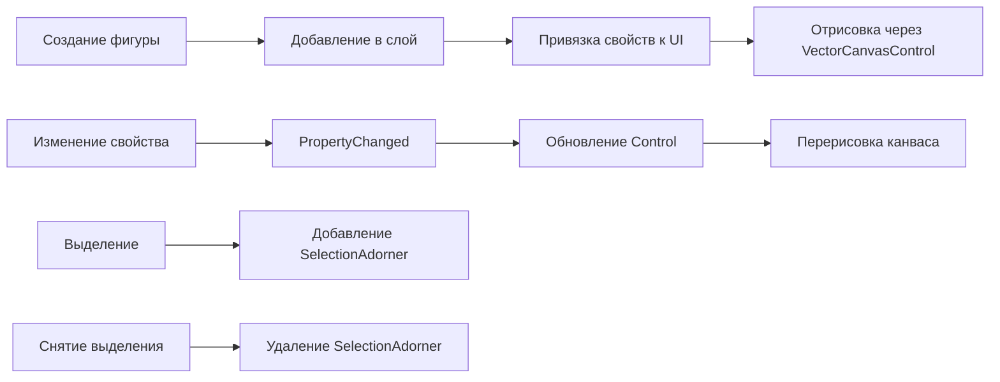

# Geometry

Документация по геометрическим моделям и примитивам графического редактора **INKognida**.

## 📁 Структура папки

```
Geometry/
├── Point2D.cs                    # Структура 2D-точки
├── PointViewModel.cs             # Реактивная обёртка точки
├── FigureViewModel.cs            # Абстрактный базовый класс фигур
├── TextViewModel.cs              # ViewModel текстовой фигуры
├── Primitives/
│   ├── RectangleViewModel.cs    # Прямоугольник
│   ├── SquareViewModel.cs       # Квадрат
│   ├── EllipseViewModel.cs      # Эллипс
│   ├── CircleViewModel.cs       # Круг
│   ├── LineViewModel.cs         # Линия
│   ├── PenPointViewModel.cs     # Точка пера
│   └── ...
├── Polygons/
│   ├── PolygonViewModel.cs      # Базовый многоугольник
│   ├── RegularPolygonViewModel.cs # Правильный многоугольник
│   ├── TriangleViewModel.cs     # Треугольник
│   ├── PentagonViewModel.cs     # Пятиугольник
│   ├── HexagonViewModel.cs      # Шестиугольник
│   ├── HeptagonViewModel.cs     # Семиугольник
│   ├── OctagonViewModel.cs      # Восьмиугольник
│   └── PentagramViewModel.cs    # Пентаграмма
├── GroupViewModel.cs             # Группа фигур
└── Interfaces/
    ├── ITransformable.cs        # Интерфейс трансформаций
    ├── ISelectable.cs           # Интерфейс выделения
    ├── ICloneableFigure.cs      # Интерфейс клонирования
    ├── IRenderable.cs           # Интерфейс отрисовки
    └── IFigure.cs               # Базовый интерфейс фигуры
```

---

## 🔷 Point2D

Структура для представления точки в двумерном пространстве.

```csharp
public readonly struct Point2D
{
    public double X { get; }
    public double Y { get; }
    
    public static Point2D Zero { get; } = new(0, 0);
    
    public Point2D(double x, double y) { ... }
    
    // Операторы
    public static Point2D operator +(Point2D a, Point2D b) { ... }
    public static Point2D operator -(Point2D a, Point2D b) { ... }
    
    // Геометрические операции
    public Point2D Rotate(Point2D center, double angleDegrees) { ... }
    public Point2D Scale(Point2D center, double sx, double sy) { ... }
    public Point2D Reflect(Point2D a, Point2D b) { ... }
    public double DistanceTo(Point2D other) { ... }
}
```

### 📋 Методы

| Метод | Описание | Возвращает |
|-------|----------|-----------|
| `Rotate(center, angle)` | Поворот точки вокруг центра на угол (градусы) | `Point2D` |
| `Scale(center, sx, sy)` | Масштабирование относительно центра | `Point2D` |
| `Reflect(a, b)` | Отражение точки относительно прямой через `a` и `b` | `Point2D` |
| `DistanceTo(other)` | Евклидово расстояние до другой точки | `double` |

---

## 🔷 PointViewModel

Реактивная обёртка над `Point2D` для привязки данных в UI через ReactiveUI.

```csharp
public class PointViewModel : ViewModelBase
{
    private double _x, _y;
    
    public double X
    {
        get => _x;
        set => this.RaiseAndSetIfChanged(ref _x, value);
    }
    
    public double Y
    {
        get => _y;
        set => this.RaiseAndSetIfChanged(ref _y, value);
    }
    
    public Point2D ToPoint() => new(X, Y);
    public void Set(Point2D point) { X = point.X; Y = point.Y; }
}
```

### 🔔 События

- `PropertyChanged` — уведомляет об изменении `X` или `Y` для реактивного обновления UI

---

## 🔷 FigureViewModel (Абстрактный базовый класс)

Базовый класс для всех векторных фигур. Реализует основные интерфейсы и предоставляет общую функциональность.

### 🧩 Реализуемые интерфейсы

| Интерфейс | Назначение |
|-----------|-----------|
| `ITransformable` | Поддержка трансформаций: `Move`, `Rotate`, `Scale` |
| `ISelectable` | Поддержка выделения: свойство `IsSelected` |
| `ICloneableFigure` | Поддержка клонирования: метод `Clone()` |
| `IRenderable` | Поддержка отрисовки: `GetRenderVertices()` |
| `IFigure` | Базовый контракт фигуры: `Id`, `Vertices`, `Center` |

### 📦 Публичные свойства

| Свойство | Тип | Описание |
|----------|-----|----------|
| `Id` | `Guid` | Уникальный идентификатор (только чтение) |
| `Name` | `string` | Отображаемое имя фигуры |
| `IsSelected` | `bool` | Флаг выделения для UI |
| `LineColor` | `Color` | Цвет обводки (System.Drawing) |
| `FillColor` | `Color` | Цвет заливки (System.Drawing) |
| `Thickness` | `double` | Толщина линии в пикселях |
| `Opacity` | `double` | Непрозрачность: 0.0–1.0 |
| `Rotation` | `double` | Угол поворота в градусах |
| `Vertices` | `ObservableCollection<PointViewModel>` | Коллекция вершин для привязки |

### 🔧 Абстрактные методы (должны быть переопределены)

```csharp
public abstract Point2D Center { get; }
public abstract IEnumerable<Point2D> GetVertexPoint();
public abstract void Rotate(double angle);
public abstract void Scale(double sx, double sy);
public abstract void Move(double dx, double dy);
public abstract bool IsIn(Point2D point, double eps = 0.001);
```

### 🛠️ Виртуальные методы (можно переопределить)

| Метод | Назначение |
|-------|-----------|
| `RadialScale(scale)` | Равномерное масштабирование по обеим осям |
| `Reflection(a, b)` | Отражение относительно прямой через точки `a` и `b` |
| `HasIntersection(leftTop, rightBottom)` | Проверка пересечения с прямоугольной областью |
| `GetBoundingBox()` | Вычисление ограничивающего прямоугольника |
| `NotifyPropertyChanged()` | Принудительное уведомление об изменении |

### 🔄 Реактивность

Класс наследуется от `ViewModelBase` (ReactiveUI), поэтому все свойства поддерживают `INotifyPropertyChanged`. Изменение вершин автоматически обновляет UI через привязки.

```csharp
// Пример подписки в контроле
figure.PropertyChanged += (s, e) =>
{
    if (e.PropertyName == nameof(FigureViewModel.LineColor))
    {
        shape.Stroke = new SolidColorBrush(ToAvaloniaColor(figure.LineColor));
    }
};
```

---

## 🔷 TextViewModel

ViewModel для текстовых фигур с поддержкой форматирования.

### 📦 Свойства

| Свойство | Тип | Описание |
|----------|-----|----------|
| `Text` | `string` | Содержимое текста |
| `FontFamily` | `string` | Название шрифта (например, "Segoe UI") |
| `FontSize` | `double` | Размер шрифта в пикселях |
| `FontWeight` | `FontWeight` | Насыщенность шрифта |
| `FontStyle` | `FontStyle` | Начертание (normal/italic) |
| `TextAlignment` | `TextAlignment` | Выравнивание (Left/Center/Right) |

### 🎨 Методы

```csharp
// Получение FormattedText для Avalonia
public Avalonia.Media.FormattedText GetFormattedText() { ... }

// Уведомление об изменении текста
public void NotifyTextChanged() { ... }
```

### 📐 Геометрия

Текст представляется как прямоугольник, размеры которого вычисляются эмпирически:

```
Ширина ≈ max(10, Text.Length × FontSize × 0.6)
Высота ≈ FontSize × 1.2
```

---

## 🔷 Primitive ViewModels

### RectangleViewModel / SquareViewModel

```csharp
public class RectangleViewModel : FigureViewModel
{
    public double X { get; }      // Левый верхний угол
    public double Y { get; }
    public double Width { get; }  // Ширина
    public double Height { get; } // Высота
    
    // Квадрат: Width == Height
}
```

### EllipseViewModel / CircleViewModel

```csharp
public class EllipseViewModel : FigureViewModel
{
    public double X { get; }      // Левый верхний угол ограничивающего прямоугольника
    public double Y { get; }
    public double Width { get; }  // Горизонтальная ось
    public double Height { get; } // Вертикальная ось
    
    // Круг: Width == Height
}
```

### LineViewModel

```csharp
public class LineViewModel : FigureViewModel
{
    public double X1 { get; }  // Начало
    public double Y1 { get; }
    public double X2 { get; }  // Конец
    public double Y2 { get; }
}
```

### PenPointViewModel

```csharp
public class PenPointViewModel : FigureViewModel
{
    public double X { get; }  // Координаты точки
    public double Y { get; }
    
    // Радиус точки вычисляется как: Math.Max(2, Thickness / 2 + 2)
}
```

---

## 🔷 Polygon ViewModels

### PolygonViewModel (Базовый)

```csharp
public abstract class PolygonViewModel : FigureViewModel
{
    public event EventHandler? VerticesChanged; // Событие изменения вершин
    
    protected void RaiseVerticesChanged() 
        => VerticesChanged?.Invoke(this, EventArgs.Empty);
}
```

### RegularPolygonViewModel

Базовый класс для правильных многоугольников (равные стороны и углы).

```csharp
public abstract class RegularPolygonViewModel : PolygonViewModel
{
    protected void UpdateVertices(Point2D center, double radius, int sides)
    {
        // Вычисление вершин правильного многоугольника
        for (int i = 0; i < sides; i++)
        {
            var angle = 2 * Math.PI * i / sides - Math.PI / 2;
            Vertices[i].X = center.X + radius * Math.Cos(angle);
            Vertices[i].Y = center.Y + radius * Math.Sin(angle);
        }
        RaiseVerticesChanged();
    }
}
```

### Конкретные реализации

| Класс | Количество сторон | Особенности |
|-------|------------------|-------------|
| `TriangleViewModel` | 3 | Произвольный треугольник по трём вершинам |
| `PentagonViewModel` | 5 | Правильный пятиугольник |
| `HexagonViewModel` | 6 | Правильный шестиугольник |
| `HeptagonViewModel` | 7 | Правильный семиугольник |
| `OctagonViewModel` | 8 | Правильный восьмиугольник |
| `PentagramViewModel` | 5 (звезда) | Пентаграмма с внешним и внутренним радиусом |

### 🌟 PentagramViewModel

Специальная реализация для пятиконечной звезды:

```csharp
public class PentagramViewModel : RegularPolygonViewModel
{
    private readonly double _outerRadius;
    private readonly double _innerRadius; // Обычно 0.382 × outerRadius
    
    public void UpdateVertices(Point2D center, double outerRadius)
    {
        // Чередование внешних и внутренних вершин
        for (int i = 0; i < 10; i++)
        {
            var radius = i % 2 == 0 ? _outerRadius : _innerRadius;
            var angle = Math.PI * i / 5 - Math.PI / 2;
            Vertices[i].X = center.X + radius * Math.Cos(angle);
            Vertices[i].Y = center.Y + radius * Math.Sin(angle);
        }
        RaiseVerticesChanged();
    }
}
```

---

## 🔷 GroupViewModel

Контейнер для группировки нескольких фигур в единый объект.

```csharp
public class GroupViewModel : FigureViewModel
{
    public ObservableCollection<FigureViewModel> Children { get; }
    
    // Группировка: передаётся список фигур
    public GroupViewModel(IEnumerable<FigureViewModel> figures) { ... }
    
    // Разгруппировка: возвращает дочерние фигуры
    public IEnumerable<FigureViewModel> Ungroup() { ... }
    
    // Получение всех ID фигур в группе (рекурсивно)
    public IEnumerable<Guid> GetAllFigureIds() { ... }
}
```

### 🔄 Трансформации группы

При трансформации группы (`Move`, `Rotate`, `Scale`) операция применяется ко всем дочерним фигурам относительно общего центра группы.

### 🎯 Выделение

- При выделении группы визуально отображается общая рамка (cyan-цвет)
- Дочерние фигуры сохраняют индивидуальные стили

---

## 🔷 Interfaces

### ITransformable

```csharp
public interface ITransformable
{
    void Move(double dx, double dy);
    void Rotate(double angle);
    void Scale(double sx, double sy);
}
```

### ISelectable

```csharp
public interface ISelectable
{
    bool IsSelected { get; set; }
}
```

### ICloneableFigure

```csharp
public interface ICloneableFigure
{
    IFigure Clone();  // Глубокое клонирование
}
```

### IRenderable

```csharp
public interface IRenderable
{
    IEnumerable<Point2D> GetRenderVertices();  // Вершины для отрисовки
}
```

### IFigure

```csharp
public interface IFigure
{
    Guid Id { get; }
    IEnumerable<Point2D> Vertices { get; }
    Point2D Center { get; }
    bool IsIn(Point2D point, double eps = 0.001);  // Hit-testing
}
```

---

## 🔄 Жизненный цикл фигуры



---

## 🎨 Отрисовка и стилизация

### Конвертация цветов

```csharp
// System.Drawing.Color → Avalonia.Media.Color
private static Avalonia.Media.Color ToAvaloniaColor(System.Drawing.Color c) =>
    Avalonia.Media.Color.FromArgb(c.A, c.R, c.G, c.B);
```

### Геометрия отрисовки

Для сложных фигур используется `StreamGeometry`:

```csharp
private StreamGeometry BuildGeometry(FigureViewModel figure)
{
    var geometry = new StreamGeometry();
    using (var ctx = geometry.Open())
    {
        ctx.BeginFigure(new Avalonia.Point(figure.Vertices[0].X, figure.Vertices[0].Y), isFilled: true);
        foreach (var vertex in figure.Vertices.Skip(1))
            ctx.LineTo(new Avalonia.Point(vertex.X, vertex.Y));
        ctx.EndFigure(isClosed: true);
    }
    return geometry;
}
```

---

## 🐛 Отладка

Все фигуры используют `DebugLog.Write()` для трассировки:

```
[DEBUG] AddFigure: ActiveLayer=Слой 1, Figure=Прямоугольник
[DEBUG] RenderFigure: Прямоугольник, DrawingCanvas=True
[DEBUG] UpdateSelectionVisual: Прямоугольник, IsSelected=True
```

Для включения логов убедитесь, что `DebugLog.IsEnabled = true` в настройках приложения.

---

## 📝 Пример создания фигуры

```csharp
// Создание прямоугольника с текущими настройками стиля
var rect = new RectangleViewModel(
    x: 100, y: 100, 
    width: 150, height: 100,
    lineColor: System.Drawing.Color.Black,
    thickness: 2.0,
    fillColor: System.Drawing.Color.FromArgb(255, 74, 144),
    opacity: 1.0);

// Добавление на активный слой
var cmd = new AddFigureCommand(rect, canvas.ActiveLayer?.Id);
cmd.Execute(canvas);
history.AddAction(cmd);  // Для Undo/Redo
```

---

> 💡 **Совет**: Все изменения геометрии должны выполняться в `Dispatcher.UIThread.Post()`, так как Avalonia требует обновления UI только из UI-потока.