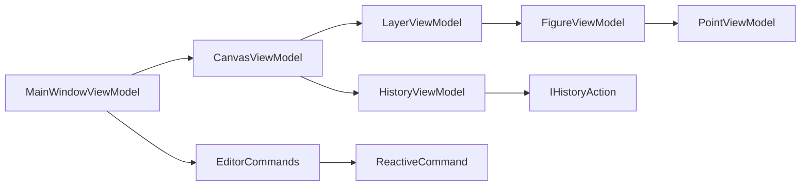

# ViewModels

Документация по ViewModel-классам графического редактора **INKognida**. Все классы реализуют паттерн MVVM с использованием ReactiveUI для реактивных привязок.

---

## 📁 Структура папки

```
ViewModels/
├── MainWindowViewModel.cs      # Главное окно, управление инструментами
├── CanvasViewModel.cs          # Состояние холста, слои, выделение
├── LayerViewModel.cs           # Модель слоя
├── FigureViewModel.cs          # Базовый класс для всех фигур
├── TextViewModel.cs            # Текстовая фигура
├── ColorViewModel.cs           # Управление цветом
├── HistoryViewModel.cs         # История действий (Undo/Redo)
└── Geometry/
    ├── RectangleViewModel.cs   # Прямоугольник
    ├── EllipseViewModel.cs     # Эллипс
    ├── CircleViewModel.cs      # Круг
    ├── LineViewModel.cs        # Линия
    ├── SquareViewModel.cs      # Квадрат
    ├── PolygonViewModel.cs     # Многоугольник
    └── ...                     # Другие примитивы
```

---

## 🪟 MainWindowViewModel

**Файл:** `ViewModels/MainWindowViewModel.cs`

### Описание

Главная ViewModel приложения. Управляет состоянием UI, инструментами рисования, историей действий и взаимодействием с канвасом.

### Зависимости

```csharp
private readonly IFileService _fileService;    // Сервис работы с файлами
private readonly HistoryViewModel _history;    // Менеджер истории Undo/Redo
public CanvasViewModel Canvas { get; }         // Модель холста
public EditorCommands Commands { get; }        // Коллекция команд ReactiveUI
```

### Основные свойства

| Свойство | Тип | Описание |
|----------|-----|----------|
| `StatusMessage` | `string` | Текст статуса для нижней панели |
| `IsDrawing` | `bool` | Флаг процесса рисования |
| `PreviewFigure` | `FigureViewModel?` | Предварительная фигура при рисовании |
| `StrokeWidth` | `int` | Толщина обводки (0–100) |
| `Opacity` | `double` | Непрозрачность в процентах |
| `FillColor` | `ColorViewModel` | Цвет заливки |
| `StrokeColor` | `ColorViewModel` | Цвет обводки |
| `CurrentTheme` | `ThemeVariant` | Светлая/тёмная тема |
| `MouseX`, `MouseY` | `double` | Координаты курсора на канвасе |
| `CoordinatesText` | `string` | Форматированный текст координат |
| `HasSelection` | `bool` | Есть ли выделенные фигуры |

### Команды (EditorCommands)

```csharp
// Фигуры
Commands.AddCircle, Commands.AddSquare, Commands.AddRectangle, ...

// Выделение
Commands.DeleteSelected, Commands.DuplicateSelected

// Трансформации
Commands.RotateLeft, Commands.RotateRight, Commands.FlipHorizontal, ...

// Зум
Commands.ZoomIn, Commands.ZoomOut, Commands.ZoomFit

// Слои
Commands.CreateNewLayer, Commands.DeleteLayerCommand, ...

// Цвет
Commands.SetFillColorCommand, Commands.SetStrokeColorCommand, ...

// Файл
Commands.Save, Commands.Open, Commands.Export
```

### Обработка ввода

```csharp
// Обработчики событий мыши
public void HandlePointerPressed(PointerPressedEventArgs e)
public void HandlePointerMoved(PointerEventArgs e)
public void HandlePointerReleased(PointerReleasedEventArgs e)

// Ввод текста
public void StartTextInput(Point2D point)
public void FinishTextInput()
public void CancelTextInput()
```

### Реактивные привязки

```csharp
// Обновление координат
_coordinatesText = this
    .WhenAnyValue(x => x.MouseX, x => x.MouseY)
    .Select(_ => $"X: {MouseX:F1}  Y: {MouseY:F1}")
    .ToProperty(this, x => x.CoordinatesText);

// Применение стиля к выделенным фигурам
this.WhenAnyValue(x => x.StrokeColor.Color)
    .Subscribe(color => ApplyStyleToSelected(f => f.LineColor = color));
```

---

## 🖼️ CanvasViewModel

**Файл:** `ViewModels/CanvasViewModel.cs`

### Описание

Управляет состоянием холста: слои, фигуры, выделение, масштабирование и панорамирование.

### Основные свойства

| Свойство | Тип | Описание |
|----------|-----|----------|
| `Layers` | `ObservableCollection<LayerViewModel>` | Коллекция слоёв |
| `ActiveLayer` | `LayerViewModel?` | Текущий активный слой |
| `IsCanvasActive` | `bool` | Холст активен (есть слой) |
| `SelectedFigure` | `FigureViewModel?` | Единственная выбранная фигура |
| `SelectedFigures` | `ObservableCollection<FigureViewModel>` | Коллекция выделенных (мульти-выделение) |
| `HasSelection` | `bool` | Есть ли выделение |
| `Zoom` | `double` | Масштаб (0.1–10.0) |
| `OffsetX`, `OffsetY` | `double` | Смещение для панорамирования |
| `PreviewFigure` | `FigureViewModel?` | Фигура предпросмотра |
| `CurrentTool` | `DrawingTool` | Активный инструмент |
| `History` | `HistoryViewModel?` | Ссылка на историю |

### Методы управления слоями

```csharp
public void ActivateCanvas()           // Создать слой если нет
public void AddFigure(FigureViewModel figure)  // Добавить фигуру
public void RemoveSelectedFigure()     // Удалить выделенную
public void DuplicateSelectedFigure()  // Дублировать
```

### Методы выделения

```csharp
public void SelectFigureAt(Point2D point, bool addToSelection = false)
public void ClearFigure()
```

### Методы трансформации

```csharp
public void MoveSelectedFigure(double dx, double dy)
public void RotateSelectedFigure(double angle)
public void ScaleSelectedFigure(double sx, double sy)
public void BringToFront()
public void SendToBack()
```

---

## 📑 LayerViewModel

**Файл:** `ViewModels/LayerViewModel.cs`

### Описание

Модель слоя холста. Содержит коллекцию фигур и настройки видимости/блокировки.

### Свойства

| Свойство | Тип | Описание |
|----------|-----|----------|
| `Id` | `Guid` | Уникальный идентификатор |
| `Name` | `string` | Отображаемое имя |
| `IsVisible` | `bool` | Видимость слоя |
| `IsLocked` | `bool` | Блокировка редактирования |
| `Figures` | `ObservableCollection<FigureViewModel>` | Коллекция фигур |
| `FigureCount` | `int` | Количество фигур (read-only) |

### Методы

```csharp
public void AddFigure(FigureViewModel figure)
public void RemoveFigure(FigureViewModel figure)
```

### Пример использования

```csharp
var layer = new LayerViewModel("Фон");
layer.IsVisible = true;
layer.IsLocked = false;
layer.AddFigure(new RectangleViewModel(...));
```

---

## 🔷 FigureViewModel (Абстрактный базовый класс)

**Файл:** `ViewModels/FigureViewModel.cs`

### Описание

Базовый класс для всех геометрических примитивов. Реализует интерфейсы:
- `ITransformable` — трансформации
- `ISelectable` — выделение
- `ICloneableFigure` — клонирование
- `IRenderable` — отрисовка
- `IFigure` — базовый контракт

### Свойства

| Свойство | Тип | Описание |
|----------|-----|----------|
| `Id` | `Guid` | Уникальный ID (read-only) |
| `Name` | `string` | Имя фигуры |
| `IsSelected` | `bool` | Флаг выделения |
| `LineColor` | `Color` | Цвет обводки |
| `FillColor` | `Color` | Цвет заливки |
| `Thickness` | `double` | Толщина линии |
| `Opacity` | `double` | Непрозрачность (0.0–1.0) |
| `Rotation` | `double` | Угол поворота |
| `Vertices` | `ObservableCollection<PointViewModel>` | Коллекция вершин |

### Абстрактные методы (должны быть переопределены)

```csharp
public abstract Point2D Center { get; }
public abstract IEnumerable<Point2D> GetVertexPoint();
public abstract void Rotate(double angle);
public abstract void Scale(double sx, double sy);
public abstract void Move(double dx, double dy);
public abstract bool IsIn(Point2D point, double eps = 0.001);
```

### Виртуальные методы

```csharp
public virtual void RadialScale(double scale) => Scale(scale, scale);
public virtual void Reflection(Point2D a, Point2D b);
public virtual bool HasIntersection(Point2D leftTop, Point2D rightBottom);
public virtual (double MinX, double MaxX, double MinY, double MaxY) GetBoundingBox();
public virtual FigureViewModel Clone() => (FigureViewModel)MemberwiseClone();
```

### Уведомления об изменениях

```csharp
public void NotifyPropertyChanged()
{
    this.RaisePropertyChanged(nameof(Vertices));
    this.RaisePropertyChanged(nameof(Center));
}
```

---

## 🔤 TextViewModel

**Файл:** `ViewModels/TextViewModel.cs`

### Описание

ViewModel для текстовой фигуры с поддержкой форматирования.

### Свойства

| Свойство | Тип | Описание |
|----------|-----|----------|
| `Text` | `string` | Содержимое текста |
| `FontFamily` | `string` | Название шрифта |
| `FontSize` | `double` | Размер в пикселях |
| `FontWeight` | `FontWeight` | Насыщенность |
| `FontStyle` | `FontStyle` | Начертание (italic) |
| `TextAlignment` | `TextAlignment` | Выравнивание |

### Конструктор

```csharp
public TextViewModel(
    double x, double y,
    string text,
    double fontSize = 24,
    string fontFamily = "Segoe UI",
    Color lineColor = default,
    Color fillColor = default,
    double opacity = 1.0)
```

### Методы

```csharp
public override void Move(double dx, double dy)
public override void Rotate(double angle)
public override void Scale(double sx, double sy)
public override bool IsIn(Point2D point, double eps = 0.001)
public override FigureViewModel Clone()
public Avalonia.Media.FormattedText GetFormattedText()  // Для отрисовки
public void NotifyTextChanged()  // Уведомление об изменении текста
```

### Вычисление размеров

```csharp
private void UpdateVertices(double x, double y)
{
    var width = Math.Max(10, _text.Length * _fontSize * 0.6);
    var height = _fontSize * 1.2;
    // ... обновление 4 вершин bounding box
}
```

---

## 🎨 ColorViewModel

**Файл:** `ViewModels/ColorViewModel.cs`

### Описание

Обёртка над `System.Drawing.Color` для реактивной привязки в UI.

### Свойства

```csharp
public Color Color { get; set; }  // System.Drawing.Color
```

### Пример использования

```csharp
var fillColor = new ColorViewModel(Color.FromArgb(255, 74, 144));
var strokeColor = new ColorViewModel(Color.Black);

// В MainWindowViewModel
public ColorViewModel FillColor { get; set; }
public ColorViewModel StrokeColor { get; set; }
```

---

## 📜 HistoryViewModel

**Файл:** `ViewModels/HistoryViewModel.cs`

### Описание

Менеджер истории действий для поддержки Undo/Redo.

### Свойства

| Свойство | Тип | Описание |
|----------|-----|----------|
| `Actions` | `ObservableCollection<IHistoryAction>` | Коллекция действий |
| `CanUndo` | `bool` | Доступна ли отмена |
| `CanRedo` | `bool` | Доступен ли повтор |
| `CurrentActionDescription` | `string` | Описание текущего действия |

### Методы

```csharp
public void AddAction(IHistoryAction action)
public void Undo()
public void Redo()
public void Clear()
public void SetCanvas(CanvasViewModel canvas)
```

### Пример команды

```csharp
public class MoveFigureCommand : IHistoryAction
{
    public string Description => "Перемещение";
    
    public void Execute(CanvasViewModel canvas) { /* ... */ }
    public void Undo() { /* ... */ }
    public void Redo() { /* ... */ }
}

// Использование
var cmd = new MoveFigureCommand(figureIds, dx, dy);
cmd.Execute(Canvas);
_history.AddAction(cmd);
```

---

## 📐 Geometry ViewModels

### RectangleViewModel

```csharp
public class RectangleViewModel : FigureViewModel
{
    public double X { get; }      // Левый верхний угол
    public double Y { get; }
    public double Width { get; }
    public double Height { get; }
}
```

### EllipseViewModel

```csharp
public class EllipseViewModel : FigureViewModel
{
    public double X { get; }
    public double Y { get; }
    public double Width { get; }   // Горизонтальная ось
    public double Height { get; }  // Вертикальная ось
}
```

### CircleViewModel

```csharp
public class CircleViewModel : FigureViewModel
{
    public double X { get; }       // Центр X
    public double Y { get; }       // Центр Y
    public double Radius { get; }
}
```

### LineViewModel

```csharp
public class LineViewModel : FigureViewModel
{
    public double X1 { get; }
    public double Y1 { get; }
    public double X2 { get; }
    public double Y2 { get; }
}
```

### PolygonViewModel (Базовый для многоугольников)

```csharp
public abstract class PolygonViewModel : FigureViewModel
{
    public event EventHandler? VerticesChanged;
    
    protected void RaiseVerticesChanged() 
        => VerticesChanged?.Invoke(this, EventArgs.Empty);
}
```

### RegularPolygonViewModel

```csharp
public abstract class RegularPolygonViewModel : PolygonViewModel
{
    protected void UpdateVertices(Point2D center, double radius, int sides)
    {
        for (int i = 0; i < sides; i++)
        {
            var angle = 2 * Math.PI * i / sides - Math.PI / 2;
            Vertices[i].X = center.X + radius * Math.Cos(angle);
            Vertices[i].Y = center.Y + radius * Math.Sin(angle);
        }
        RaiseVerticesChanged();
    }
}
```

---

## 🔄 Жизненный цикл ViewModel



---

## 📋 Чеклист реализации ViewModel

| Компонент | Статус |
|-----------|--------|
| ✅ MainWindowViewModel | Реализовано |
| ✅ CanvasViewModel | Реализовано |
| ✅ LayerViewModel | Реализовано |
| ✅ FigureViewModel (base) | Реализовано |
| ✅ TextViewModel | Реализовано |
| ✅ ColorViewModel | Реализовано |
| ✅ HistoryViewModel | Реализовано |
| ✅ Все примитивы | Реализовано |
| ⚠️ GroupViewModel | Требует тестирования |
| ⚠️ BezierCurveViewModel | Запланировано |

---

## 🎯 Лучшие практики

1. **Всегда используйте `RaiseAndSetIfChanged`** для свойств
2. **Уведомляйте о зависимых свойствах**:
   ```csharp
   set 
   { 
       this.RaiseAndSetIfChanged(ref _field, value);
       this.RaisePropertyChanged(nameof(DependentProperty));
   }
   ```
3. **Избегайте утечек памяти** — отписывайтесь от событий в `OnDetachedFromVisualTree`
4. **Используйте `Dispatcher.UIThread.Post()`** для обновлений UI из фоновых потоков
5. **Клонируйте фигуры глубоко** при дублировании

---

> 💡 **Совет**: Для отладки привязок включите логирование в `DebugLog.Write()` и следите за сообщениями `[DEBUG] PropertyChanged` в консоли.