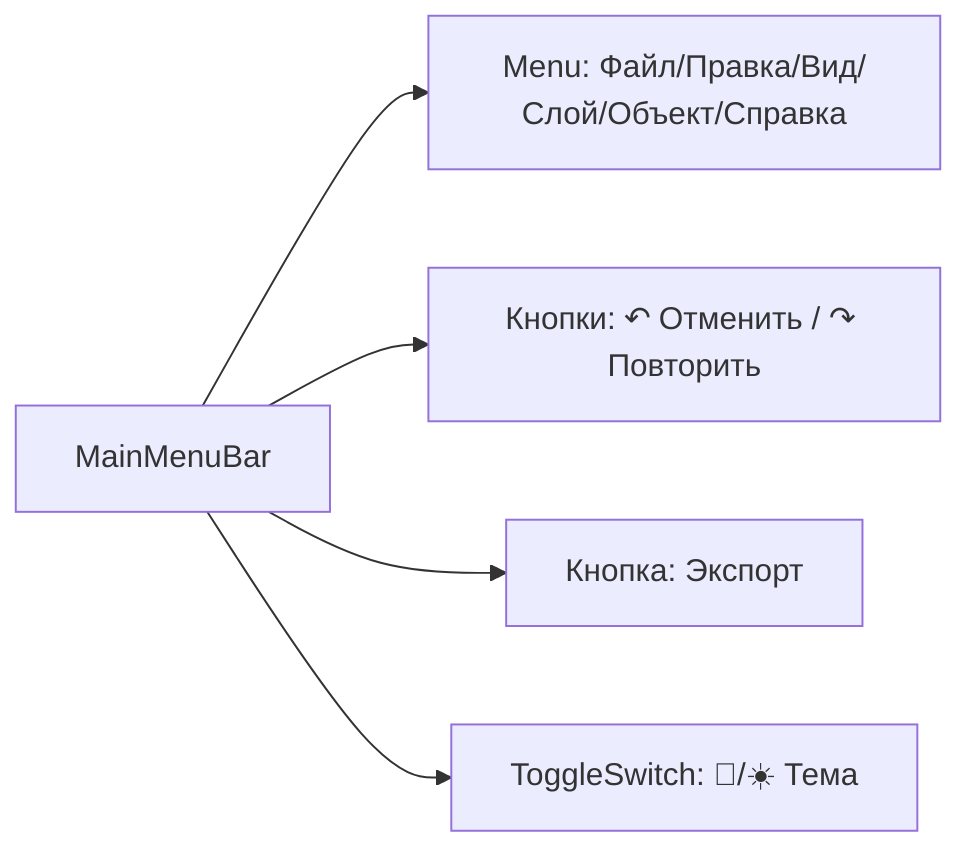
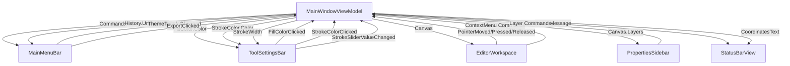

# 🎨 INKognida — GUI Documentation

> Векторный графический редактор на AvaloniaUI с компонентной архитектурой

---

## 📋 Оглавление

1. [Обзор архитектуры](#-обзор-архитектуры)
2. [Компоненты интерфейса](#-компоненты-интерфейса)
3. [Схема данных и bindings](#-схема-данных-и-bindings)
4. [Стилизация и темы](#-стилизация-и-темы)
5. [Ключевые взаимодействия](#-ключевые-взаимодействия)
6. [Структура проекта](#-структура-проекта)

---

## 🏗️ Обзор архитектуры

```
MainWindow (Window)
├── MainMenuBar (Component)          # Верхнее меню + экспорт + тема
├── ToolSettingsBar (Component)      # Панель параметров инструмента
├── EditorWorkspace (Component)      # Холст + линейки + контекстное меню
│   ├── ToolsSidebar (Component)     # Левая панель инструментов
│   └── PropertiesSidebar (Component)# Правая панель свойств/слоёв
└── StatusBarView (Component)        # Нижняя панель состояния

Shared:
├── ColorPickerPopup (Component)     # Переиспользуемый пикер цвета
└── VectorCanvasControl (Custom)     # Кастомный контрол отрисовки
```

### 🔑 Принципы

| Принцип | Описание |
|---------|----------|
| **MVVM + ReactiveUI** | ViewModel управляет состоянием, View реагирует на изменения |
| **Компонентная декомпозиция** | Каждый UI-блок — изолированный `UserControl` |
| **Событийная коммуникация** | Компоненты общаются через `public event`, а не прямые ссылки |
| **Data Binding** | Все данные привязаны к свойствам `MainWindowViewModel` |
| **Темизация** | Единая система светлой/тёмной темы через `RequestedThemeVariant` |

---

## 🧩 Компоненты интерфейса

### 1️⃣ MainMenuBar

**Расположение:** `Grid.Row="0"`, полная ширина



| Элемент | Binding / Событие | Описание |
|---------|------------------|----------|
| `MenuItem "Открыть"` | `OpenClicked` event | Загрузка проекта `.vec`, `.svg`, `.json` |
| `MenuItem "Сохранить"` | `SaveClicked` event | Сохранение в текущий файл |
| `MenuItem "Сохранить как"` | `SaveAsClicked` event | Диалог сохранения с выбором пути |
| `Button "↶"` | `Command="{Binding History.Undo}"` | Отмена действия |
| `Button "↷"` | `Command="{Binding History.Redo}"` | Повтор действия |
| `Button "Экспорт"` | `ExportClicked` event | Экспорт в PNG/JPEG/BMP/PDF |
| `ToggleSwitch` | `ThemeToggleChanged` event | Переключение Light/Dark темы |

**Code-behind:** `MainMenuBar.axaml.cs`
```csharp
public event EventHandler<bool>? ThemeToggleChanged;
public event EventHandler<RoutedEventArgs>? ExportClicked;
// ... другие события
public ToggleSwitch ThemeToggleElement { get; }
```

---

### 2️⃣ ToolSettingsBar

**Расположение:** `Grid.Row="1"`, полная ширина

```
┌─────────────────────────────────────────────────┐
│ Инструмент: [Перо] │ Заливка: [■] │ Обводка: [■] [1пкс▼] │ ───●─── 75% │
└─────────────────────────────────────────────────┘
```

| Элемент | Binding | Описание |
|---------|---------|----------|
| `TextBlock SelectedToolText` | — | Отображение текущего инструмента |
| `Button FillColorButton` | `FillColorClicked` event | Открытие пикера заливки |
| `Popup ColorPopup` | `IsOpen="{Binding IsColorPickerOpen}"` | Всплывающий пикер заливки |
| `Button StrokeColorButton` | `StrokeColorClicked` event | Открытие пикера обводки |
| `Popup StrokeColorPopup` | `IsOpen="{Binding IsStrokeColorPickerOpen}"` | Всплывающий пикер обводки |
| `ComboBox` (толщина) | — | Выбор preset толщины линии |
| `Slider StrokeSlider` | `Value="{Binding StrokeWidth}"` | Точная настройка толщины |
| `TextBlock StrokePercentText` | — | Отображение значения слайдера |

**Code-behind:** `ToolSettingsBar.axaml.cs`
```csharp
public event EventHandler<RoutedEventArgs>? FillColorClicked;
public event EventHandler<RangeBaseValueChangedEventArgs>? StrokeSliderValueChanged;
public Popup ColorPopupElement { get; }
public void OpenFillColorPicker() => ColorPopup.IsOpen = true;
```

---

### 3️⃣ EditorWorkspace

**Расположение:** `Grid.Row="2", Grid.Column="1"` (центральная область)

```
┌─────────────────────────────────────┐
│ [📄 Безымянный.vec ×] [＋]          │ ← Вкладки документов
├─────────────────────────────────────┤
│ 0   100   200   300   400   500    │ ← Горизонтальная линейка
├────┬────────────────────────────────┤
│ 0  │                                │
│    │  ┌──────────────────┐         │
│100 │  │  [CheckerBrush]  │         │
│    │  │   VectorCanvas   │         │ ← Холст с контекстным меню
│200 │  │                  │         │
│    │  └──────────────────┘         │
└────┴────────────────────────────────┘
```

#### 🔹 Контекстное меню (ПКМ на холсте)

```
Поворот
├─ ↶ Влево (90°)      → Commands.RotateLeft
├─ ↷ Вправо (90°)     → Commands.RotateRight
└─ ↻ На 180°          → Commands.RotateFull

Масштаб
├─ 🔍 Увеличить (150%) → Commands.ZoomIn
├─ 🔎 Уменьшить (50%)  → Commands.ZoomOut
└─ По размеру окна     → Commands.ZoomFit

Отражение
├─ ↔ По горизонтали    → Commands.FlipHorizontal
└─ ↕ По вертикали      → Commands.FlipVertical

─ ─ ─ ─ ─ ─ ─ ─ ─ ─ ─ ─

Перемещение
├─ ↑ Вверх (10px)      → Commands.MoveUp
├─ ↓ Вниз (10px)       → Commands.MoveDown
├─ ← Влево (10px)      → Commands.MoveLeft
└─ → Вправо (10px)     → Commands.MoveRight

Группа
├─ 📦 Сгруппировать    → Commands.GroupSelected (Ctrl+G)
└─ 📦 Разгруппировать  → Commands.UngroupSelected (Ctrl+Shift+G)

─ ─ ─ ─ ─ ─ ─ ─ ─ ─ ─ ─

Цвет заливки
├─ 🔴 Красный          → Commands.SetFillColorCommand(Red)
├─ 🟢 Зелёный          → ...
├─ 🔵 Синий            → ...
├─ 🟡 Жёлтый           → ...
├─ ⚪ Белый            → ...
├─ ⚫ Чёрный           → ...
└─ 🎨 Выбрать цвет…    → Commands.OpenFillColorPickerCommand

─ ─ ─ ─ ─ ─ ─ ─ ─ ─ ─ ─

🗑️ Удалить объект     → Commands.DeleteSelected
📋 Дублировать         → Commands.DuplicateSelected
```

#### 🔹 VectorCanvasControl (кастомный контрол)

| Свойство | Binding | Описание |
|----------|---------|----------|
| `CanvasViewModel` | `{Binding Canvas}` | ViewModel холста с коллекцией фигур |
| `Zoom` | `{Binding Canvas.Zoom}` | Коэффициент масштабирования |
| `OffsetX` / `OffsetY` | `{Binding Canvas.OffsetX/Y}` | Смещение видимой области |
| `ScreenToCanvas(Point)` | — | Конвертация экранных координат в координаты холста |

**Поддержка фигур:**
- ✅ `RectangleViewModel`, `EllipseViewModel`, `LineViewModel`
- ✅ `PolygonViewModel` (многоугольники, треугольники)
- ✅ `PenPointViewModel` (точки пера)
- ✅ `TextViewModel` (текстовые блоки)
- ✅ `GroupViewModel` (группировка фигур)

---

### 4️⃣ ToolsSidebar

**Расположение:** `Grid.Column="0"`, левая панель

```
┌────────┐
│ TOOLS  │
├────────┤
│ [🖱] Выделение   ← активен (синий фон)
│ [✂️] Прямое выделение
│ [🧽] Ластик
├────────┤
│ [───] Линия
│ [▭] Прямоугольник
│ [□] Квадрат
│ [⬭] Эллипс
│ [○] Круг
│ [✎] Перо
│ [⬟] Пятиугольник
│ [⬢] Шестиугольник
│ [★] Пентаграмма
│ [△] Треугольник
├────────┤
│ [T] Текст
│ [✋] Рука (панорама)
│ [🔍] Масштаб
└────────┘
```

| Элемент | Tag | ToolTip | Событие |
|---------|-----|---------|---------|
| `RadioButton "🖱"` | `"Выделение"` | `Выделение (V)⏎Ctrl+Click — мульти-выделение` | `ToolButtonChecked` |
| `RadioButton "✂️"` | `"Прямое выделение"` | `Прямое выделение (A)` | `ToolButtonChecked` |
| `RadioButton "✎"` | `"Перо"` | `Перо (P)` | `ToolButtonChecked` |
| ... | ... | ... | ... |

**Логика:**
```csharp
// В MainWindow.axaml.cs
ToolsSidebarControl.ToolButtonChecked += (s, e) => 
{
    if (s is RadioButton rb && rb.Tag is string toolName)
    {
        _viewModel.SetToolByName(toolName); // Переключение инструмента в VM
        ToolSettingsBarControl.SelectedToolTextElement.Text = toolName;
    }
};
```

---

### 5️⃣ PropertiesSidebar

**Расположение:** `Grid.Column="2"`, правая панель

#### 🔹 Вкладка "Свойства"

```
Трансформация
┌──────┬──────┐
│ X: [120] │ Y: [240] │
└──────┴──────┘

Внешний вид
Заливка: [■ превью цвета]
Обводка: [■] [══ 25% ══] 25px

Непрозрачность: [●────────○] 75%
                [градиент превью]
```

| Элемент | Binding | Описание |
|---------|---------|----------|
| `TextBox` (X/Y) | — | Ручной ввод координат (планируется binding) |
| `Border` (Заливка) | `Background="{Binding FillColor.Color, Converter=ColorToBrushConverter}"` | Превью цвета заливки |
| `Border` (Обводка) | `Background="{Binding StrokeColor.Color, Converter=ColorToBrushConverter}"` | Превью цвета обводки |
| `Border` (ширина) | `Width="{Binding StrokeWidth}"` | Визуализация толщины линии |
| `Slider` | `Value="{Binding Opacity, Mode=TwoWay}"` | Регулировка прозрачности |
| `Border` (градиент) | `LinearGradientBrush` с `Offset="{Binding Opacity, Converter=PercentToDoubleConverter}"` | Превью градиента прозрачности |

#### 🔹 Вкладка "Слои"

```
┌─────────────────────────┐
│ [📄＋] [🗑️] [🔒]       │ ← Кнопки управления
├─────────────────────────┤
│ [👁️] [Слой 1 ▼] [🔓] [🗑️] ● │
│ [👁️] [Фон      ] [🔒] [🗑️]   │
│ [ ]  [Скрытый ] [🔓] [🗑️]   │
└─────────────────────────┘
```

| Элемент | Binding | Описание |
|---------|---------|----------|
| `Button "📄＋"` | `Command="{Binding Commands.CreateNewLayer}"` | Создание нового слоя |
| `Button "🗑️"` | `Command="{Binding Commands.DeleteLayerCommand}"`, `IsEnabled="{Binding Canvas.Layers.Count, Converter=IsGreaterThanOneConverter}"` | Удаление слоя (не последний) |
| `Button "🔒"` | `Command="{Binding Commands.ToggleLockLayerCommand}"` | Блокировка/разблокировка |
| `ToggleButton "👁️"` | `IsChecked="{Binding IsVisible}"`, `Command="{Binding Commands.ToggleVisibilityLayerCommand}"` | Видимость слоя |
| `TextBox` (имя) | `Text="{Binding Name}"` | Редактирование имени слоя |
| `ToggleButton "🔓"` | `IsChecked="{Binding IsLocked}"` | Состояние блокировки |
| `Border` (индикатор) | `Background="{Binding IsVisible, Converter=BoolToBrushConverter}"` | Цветной маркер видимости |

---

### 6️⃣ StatusBarView

**Расположение:** `Grid.Row="3"`, полная ширина

```
┌─────────────────────────────────────────────────┐
│ [Статус: Готово ✓] │ [X: 120, Y: 240] [Ш:480 В:320] │ [100%] │ [RGB] │
└─────────────────────────────────────────────────┘
```

| Элемент | Binding | Описание |
|---------|---------|----------|
| `TextBlock` (статус) | `Text="{Binding StatusMessage}"` | Сообщения о действиях пользователя |
| `TextBlock` (координаты) | `Text="{Binding CoordinatesText}"` | Координаты курсора на холсте |
| `TextBlock` (размеры) | — | Статические размеры холста |
| `TextBlock` (масштаб) | — | Текущий масштаб (планируется binding) |
| `TextBlock` (режим) | — | Цветовой режим (RGB/CMYK) |

---

### 7️⃣ ColorPickerPopup (Shared Component)

**Использование:** Внутри `ToolSettingsBar` в `Popup`

```
┌─────────────────┐
│ [■■■■■■■■]      │ ← Превью цвета
│ # [FF4A90  ]    │ ← HEX-ввод
│ 🔴 🟢 🔵 🟡    │ ← Палитра (12 preset)
│ ⚪ ⚫ 🔶 🟣    │
│ [Отмена] [ОК]   │
└─────────────────┘
```

| Метод / Событие | Описание |
|----------------|----------|
| `event Action<Color> ColorSelected` | Вызывается при нажатии "ОК" с выбранным цветом |
| `event Action Cancelled` | Вызывается при нажатии "Отмена" |
| `void SetColor(Color color)` | Инициализация пикера текущим цветом |
| `HexInput_TextChanged` | Авто-обновление превью при вводе HEX |
| `SwatchPanel` click | Быстрый выбор из палитры |

---

## 🔗 Схема данных и bindings



### 🔹 Конвертеры (Converters)

| Конвертер | Назначение | Пример использования |
|-----------|------------|---------------------|
| `ColorToBrushConverter` | `System.Drawing.Color` → `Avalonia.Media.Brush` | `Background="{Binding FillColor.Color, Converter=ColorToBrushConverter}"` |
| `DrawingColorConverter` | `System.Drawing.Color` → `Avalonia.Media.Color` | `GradientStop Color="{Binding FillColor.Color, Converter=DrawingColorConverter}"` |
| `PercentToDoubleConverter` | `int` (0-100) → `double` (0.0-1.0) | `Offset="{Binding Opacity, Converter=PercentToDoubleConverter}"` |
| `MathSubtractConverter` | `MultiBinding`: A - B | `Rectangle.Width` для выделения области |
| `IsGreaterThanOneConverter` | `int` → `bool`: `value > 1` | `IsEnabled` для кнопки удаления слоя |
| `BoolToBrushConverter` | `bool` → `Brush`: `true=#0078D4`, `false=Transparent` | Индикатор видимости слоя |
| `InvertedBoolConverter` | `bool` → `!bool` | `IsVisible="{Binding Canvas.IsCanvasActive, Converter=InvertedBoolConverter}"` |

---

## 🎨 Стилизация и темы

### 🔹 Система тем

```csharp
// В MainWindow.axaml
RequestedThemeVariant="Dark"  // или "Light"

// В компоненте (пример MainMenuBarStyles.axaml)
<Style Selector="Window[RequestedThemeVariant=Light] Button.ToolActionBtn">
    <Setter Property="Background" Value="#E8E8E8"/>
    <Setter Property="Foreground" Value="#333333"/>
</Style>
```

| Элемент | Тёмная тема | Светлая тема |
|---------|-------------|--------------|
| Фон окна | `#1C1C1E` | `#F5F5F5` |
| Панели | `#252526` / `#2C2C2E` | `#E8E8E8` / `#F0F0F0` |
| Текст | `#CCCCCC` / `#999999` | `#333333` / `#666666` |
| Акцент | `#0078D4` (синий) | `#0078D4` (синий) |
| Разделители | `#3F3F46` | `#D0D0D0` |
| CheckerBrush (фон холста) | `#252526` / `#2F2F32` | `#FFFFFF` / `#F0F0F0` |

### 🔹 Общие стили (`GraphicEditorStyles.axaml`)

```xml
<Style Selector="Border.ThemePanel">
    <Setter Property="Background" Value="#252526"/>
    <Setter Property="BorderBrush" Value="#3F3F46"/>
</Style>

<Style Selector="Border.ThemeRuler">
    <Setter Property="Background" Value="#252526"/>
    <Setter Property="BorderBrush" Value="#3F3F46"/>
</Style>

<Style Selector="Border.ThemeStatusBar">
    <Setter Property="Background" Value="#2C2C2E"/>
    <Setter Property="BorderBrush" Value="#3F3F46"/>
</Style>

<Style Selector="RadioButton.ToolButton:checked">
    <Setter Property="Background" Value="#0078D4"/>
    <Setter Property="Foreground" Value="White"/>
</Style>
```

---

## ⌨️ Ключевые взаимодействия

### 🔹 Горячие клавиши (глобальные)

| Комбинация | Действие | Binding |
|------------|----------|---------|
| `Ctrl+N` | Новый проект | — |
| `Ctrl+O` | Открыть проект | `OpenMenuItem_Click` |
| `Ctrl+S` | Сохранить | `SaveMenuItem_Click` |
| `Ctrl+Shift+S` | Сохранить как | `SaveAsMenuItem_Click` |
| `Ctrl+Z` | Отменить | `History.Undo` |
| `Ctrl+Y` | Повторить | `History.Redo` |
| `Ctrl+G` | Сгруппировать | `Commands.GroupSelected` |
| `Ctrl+Shift+G` | Разгруппировать | `Commands.UngroupSelected` |
| `Ctrl+OemPlus` / `Ctrl+OemMinus` | Масштаб +/- | `Commands.ZoomIn` / `ZoomOut` |
| `Ctrl+0` | Масштаб 100% | `Commands.ZoomFit` |
| `↑` / `↓` / `←` / `→` | Перемещение на 10px | `Commands.MoveUp/Down/Left/Right` |

### 🔹 Инструменты (горячие клавиши)

| Инструмент | Клавиша | Описание |
|------------|---------|----------|
| Выделение | `V` | Стандартное выделение объектов |
| Прямое выделение | `A` | Выделение точек/вершин |
| Ластик | `E` | Удаление объекта по клику |
| Линия | `L` | Рисование линии |
| Перо | `P` | Свободное рисование |
| Текст | `T` | Добавление текстового блока |
| Рука | `H` | Панорамирование холста |
| Масштаб | `Z` | Зум-инструмент |

### 🔹 Ввод текста на холсте

```csharp
// Обработка в MainWindow.axaml.cs
private void OnWindowKeyDown(object? sender, KeyEventArgs e)
{
    if (_viewModel?.IsDrawing == true && _viewModel.CurrentTool == DrawingTool.Text)
    {
        if (e.Key == Key.Enter)      // Завершить ввод
            _viewModel.FinishTextInput();
        else if (e.Key == Key.Escape) // Отменить ввод
            _viewModel.CancelTextInput();
        else if (e.Key == Key.Back)   // Удалить символ
            text.Text = text.Text[..^1];
        // ... добавление символов
    }
}
```

---

## 📁 Структура проекта

```
graphic_editor/
├── Views/
│   ├── MainWindow.axaml(.cs)          # Главный координатор
│   └── Components/                    # Компоненты интерфейса
│       ├── MainMenuBar/
│       │   ├── MainMenuBar.axaml
│       │   ├── MainMenuBar.axaml.cs
│       │   └── MainMenuBarStyles.axaml
│       ├── ToolSettingsBar/           # Аналогично для всех компонентов
│       ├── ToolsSidebar/
│       ├── EditorWorkspace/
│       ├── PropertiesSidebar/
│       ├── StatusBarView/
│       └── ColorPickerPopup/
├── ViewModels/
│   ├── MainWindowViewModel.cs         # Корневая VM
│   ├── CanvasViewModel.cs             # VM холста
│   ├── LayerViewModel.cs              # VM слоя
│   ├── EditorCommands.cs              # Коллекция команд (ReactiveCommand)
│   └── Geometry/Figures/              # VM фигур (RectangleViewModel и др.)
├── Controls/
│   └── VectorCanvasControl.axaml(.cs) # Кастомный контрол отрисовки
├── Converters/                        # Все конвертеры
├── Styles/
│   └── GraphicEditorStyles.axaml      # Глобальные стили
├── Services/                          # FileService, ProjectService
├── IO/                                # Экспорт: PngExporter, PdfExporter и др.
└── Helpers/                           # DebugLog, StyleSettings
```

---

## 🚀 Запуск и отладка

```bash
# Сборка проекта
dotnet build graphic_editor.sln

# Запуск в режиме отладки
dotnet run --project graphic_editor/graphic_editor.csproj

# Логирование (включено в DebugLog)
[DEBUG] ToolButton_Checked: Setting SelectedTool to 'Перо'
[DEBUG] CanvasVM PropertyChanged: PreviewFigure
[ERROR] Export failed: Access denied
```

---

> 💡 **Советы по расширению:**
> 1. Новые инструменты добавляйте в `ToolsSidebar` + регистрируйте `Tag` в `SetToolByName()`
> 2. Новые команды создавайте в `EditorCommands.cs` как `ReactiveCommand`
> 3. Для новых конвертеров наследуйтесь от `IValueConverter` и регистрируйте в `Window.Resources`
> 4. Стилизацию под новую тему добавляйте через `Window[RequestedThemeVariant=Light]` селекторы

---

*Документация актуальна для версии 1.0.0 • © 2026 Dream Team CO* 🎨✨